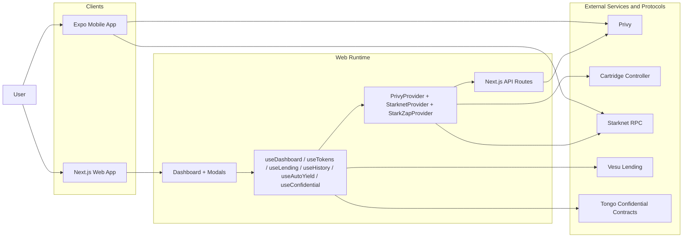
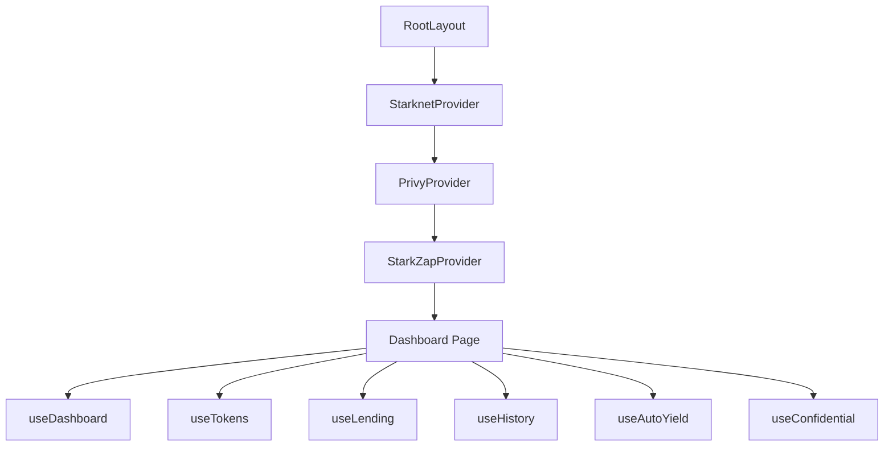
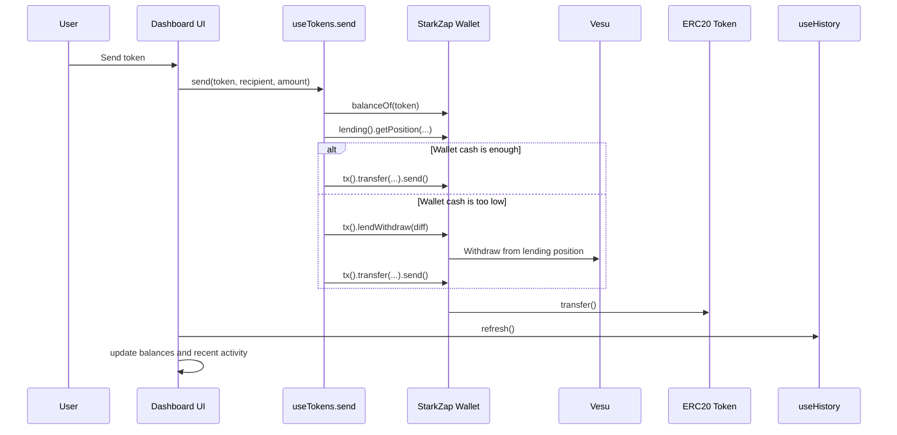
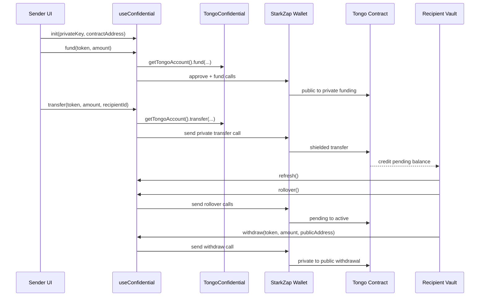

# Otterpay

Otterpay is a Starknet payments application built around three ideas:

- social-first wallet onboarding with Privy and Cartridge
- yield-aware balances backed by Vesu lending
- confidential transfers powered by Tongo on Starknet Sepolia

The repository currently contains two client applications:

- `frontend/web`: the primary, production-focused implementation in Next.js
- `frontend/mobile`: an Expo mobile scaffold that mirrors the product direction but is not yet feature-complete with the web app

## What Is Implemented Today

### Web app

- Cartridge Controller connection on Starknet Sepolia
- StarkZap SDK integration with custom patches for provider compatibility and Cartridge controller execution
- portfolio dashboard showing wallet balances plus Vesu-supplied balances
- manual Vesu supply and withdrawal flows
- smart send flow that can withdraw from Vesu before transferring if wallet cash is insufficient
- public transaction history from on-chain ERC20 `Transfer` events
- private STRK vaults with Tongo:
  - create or import a vault
  - fund privately from public balance
  - send private-to-private transfers
  - withdraw private balance back to a public Starknet address
  - rollover pending incoming private funds into active balance
  - review recent confidential activity

### Mobile app

- Expo shell and basic Otterpay home screen
- StarkZap native provider scaffolding
- mirrored hook structure for dashboard, lending, history, yield, and confidential features

The mobile app is currently best described as a product prototype scaffold rather than a parity implementation of the web app.

## Repository Layout

```text
.
├── README.md
├── StarkPay_Product_Architecture.md
└── frontend
    ├── mobile
    │   ├── src/app
    │   ├── src/hooks
    │   └── src/providers
    └── web
        ├── src/app
        │   ├── api/privy
        │   ├── page.tsx
        │   ├── receive/page.tsx
        │   └── send/page.tsx
        ├── src/hooks
        ├── src/providers
        └── certificates
```

## System Architecture

### High-level architecture



### Web runtime composition

The web app is the current source of truth for the product. The runtime is composed in `frontend/web/src/app/layout.tsx`:



### Public asset and yield flow



### Confidential transfer flow



## Core Application Modules

### Provider layer

#### `frontend/web/src/providers/PrivyProvider.tsx`

- configures Privy login methods
- drives social authentication for web users
- enables embedded Ethereum wallet creation for Privy accounts

#### `frontend/web/src/providers/StarknetProvider.tsx`

- initializes `@starknet-react/core`
- registers the Cartridge controller connector
- pins the default chain to Starknet Sepolia
- declares the Cartridge policy allowlist for ERC20 transfers and Vesu deposit/withdraw entrypoints

#### `frontend/web/src/providers/StarkZapProvider.tsx`

- initializes the StarkZap SDK
- connects Privy-backed wallets through Next.js API routes
- syncs Cartridge controller accounts into StarkZap using a custom `CartridgeWallet` wrapper
- patches provider/listener compatibility for legacy dependencies
- patches deploy-account signing support for the current SignerAdapter runtime behavior

This is the most integration-heavy part of the system because it bridges:

- Privy
- Cartridge
- StarkZap
- Starknet RPC

### Hook layer

#### `useDashboard`

- fetches wallet balances through `useTokens`
- fetches Vesu positions through `useLending`
- falls back to on-chain Vesu vToken reads on Sepolia when needed
- computes:
  - total USD balance
  - total supplied USD
  - asset-level wallet versus lending splits
- refreshes public transaction history

#### `useTokens`

- resolves StarkZap token presets for the connected chain
- fetches ERC20 balances
- sends tokens
- automatically withdraws from Vesu during send when wallet liquidity is insufficient

#### `useLending`

- deposits into Vesu
- withdraws a specific amount from Vesu
- withdraws the full position
- fetches single positions and all lending positions

#### `useHistory`

- fetches public ERC20 transfer history from Starknet events
- distinguishes:
  - sent
  - received
  - deposit
  - withdrawal
- maps Vesu pool and vToken addresses back to the underlying asset

#### `useAutoYield`

- polls for incoming ERC20 transfer events
- exposes status about auto-yield activity and deposit confirmations
- currently defaults to manual supply mode in the web app

Important product note:

- the hook still contains deposit orchestration logic
- the dashboard currently uses `autoSweepIdleBalances: false`
- funds do not silently move into Vesu by default

#### `useConfidential`

- initializes and manages a Tongo confidential vault
- stores decrypted vault state in React state
- supports:
  - fund
  - transfer
  - withdraw
  - rollover
  - full exit
- converts between public token units and Tongo confidential units
- enforces Tongo bit-size limits with user-friendly errors
- reads private activity history directly from the Tongo account

### Server routes

The web app has a small server-side layer inside Next.js:

#### `frontend/web/src/app/api/privy/wallet/route.ts`

- resolves or creates a Privy-linked Starknet wallet for a user
- returns wallet id, address, and public key

#### `frontend/web/src/app/api/privy/sign/route.ts`

- signs raw Starknet hashes on behalf of a Privy-linked wallet
- uses server-side Privy authorization keys
- contains a signer fix-up path to add the authorization key if the wallet returns a 401

This means the repo does not contain a separate backend service. The only backend logic currently in-repo is the Next.js API route layer.

## Supported User Journeys

### 1. Social or controller wallet connection

- Privy users authenticate with email or supported social providers
- the web API resolves or creates a Starknet embedded wallet
- StarkZap connects to that account for public transactions
- alternatively, users can connect through Cartridge Controller on Sepolia

### 2. Public wallet dashboard

- the dashboard reads balances for core assets such as STRK, ETH, and USDC
- it combines wallet balance and lending balance per asset
- it renders recent public transaction history from Starknet events

### 3. Yield with Vesu

- users explicitly supply funds to Vesu from the dashboard
- supplied balances remain visible in the dashboard as yield positions
- users can withdraw partially or fully from Vesu at any time
- when a user sends funds and wallet cash is too low, the app can withdraw from Vesu first and then transfer

### 4. Confidential transfers with Tongo

- users create or import a separate Tongo private key
- the key is distinct from the Starknet wallet key
- users fund the vault from their public STRK balance
- private transfers are sent to a Tongo recipient identity, not a Starknet address
- incoming private transfers land in pending balance first
- recipients must run rollover before pending private balance becomes active/spendable
- active private balance can be withdrawn back to a public Starknet address

## Network and Contract Assumptions

The current implementation is centered on Starknet Sepolia.

### Sepolia addresses used directly in the web implementation

| Asset / Contract | Address |
| --- | --- |
| STRK | `0x4718f5a0fc34cc1af16a1cdee98ffb20c31f5cd61d6ab07201858f4287c938d` |
| ETH | `0x049d36570d4e46f48e99674bd3fcc84644ddd6b96f7c741b1562b82f9e004dc7` |
| USDC | `0x053c9125369e0151fbc37828196ed33c094b9d05b7f0300d3914966e53401777` |
| Vesu default pool | `0x06227c13372b8c7b7f38ad1cfe05b5cf515b4e5c596dd05fe8437ab9747b2093` |
| Vesu pool factory | `0x03ac869e64b1164aaee7f3fd251f86581eab8bfbbd2abdf1e49c773282d4a092` |
| Tongo private STRK contract | `0x408163bfcfc2d76f34b444cb55e09dace5905cf84c0884e4637c2c0f06ab6ed` |

## Local State and Data Boundaries

### Browser-local state

- modal state and optimistic UI state live in React component state
- the Tongo private key can be stored in `localStorage`
- the storage key is namespaced by:
  - connected public wallet address
  - confidential contract address

### Chain and protocol data

- public balances come from StarkZap wallet reads
- Vesu positions come from StarkZap lending APIs plus direct on-chain fallback reads
- public transaction history comes from Starknet `getEvents`
- confidential state and confidential history come from the Tongo account APIs


### Mobile (`frontend/mobile`)

The mobile scaffold includes `.env.example`, but the provider currently still contains placeholder backend URLs. Treat the mobile environment file as preparatory rather than production-ready.

## Recommended Development Workflow

### Web

```bash
cd frontend/web
npm run lint
```

### Mobile

```bash
cd frontend/mobile
npm run lint
```

## Operational Notes

- the main product experience currently lives on `frontend/web/src/app/page.tsx`
- `frontend/web/src/app/send/page.tsx` and `frontend/web/src/app/receive/page.tsx` are present but still mostly UI placeholders compared with the dashboard modal flow
- confidential transfers are currently wired for STRK on Sepolia only
- receiving a confidential transfer does not immediately increase spendable balance; the recipient must rollover pending balance first
- public activity history and confidential activity history are separate surfaces
- the repository includes local development certificates under `frontend/web/certificates`, but the default Next.js development command still runs without custom HTTPS wiring

## Known Limitations

- the mobile app is not yet feature-complete with the web app
- confidential vault support is currently single-token and single-network in practice:
  - STRK
  - Starknet Sepolia
- some older docs in the repository describe product intentions that are broader than the current implementation
- Hyperlane and broader multi-chain dependencies are installed but are not yet a primary active flow in the current web dashboard

## Where To Start Reading The Code

If you are new to the codebase, this order gives the best picture of the live system:

1. `frontend/web/src/app/layout.tsx`
2. `frontend/web/src/providers/StarknetProvider.tsx`
3. `frontend/web/src/providers/StarkZapProvider.tsx`
4. `frontend/web/src/app/page.tsx`
5. `frontend/web/src/hooks/useDashboard.ts`
6. `frontend/web/src/hooks/useTokens.ts`
7. `frontend/web/src/hooks/useLending.ts`
8. `frontend/web/src/hooks/useHistory.ts`
9. `frontend/web/src/hooks/useConfidential.ts`

## Summary

Otterpay is currently a Starknet Sepolia-focused payments client where:

- onboarding happens through Privy or Cartridge
- public balances can be supplied to Vesu and withdrawn on demand
- public sends can tap Vesu liquidity when needed
- STRK can also move through confidential Tongo vaults with pending-to-active rollover semantics

The web app is the most accurate representation of the current product, and this README should be treated as the main source of truth for the repository-level architecture.
